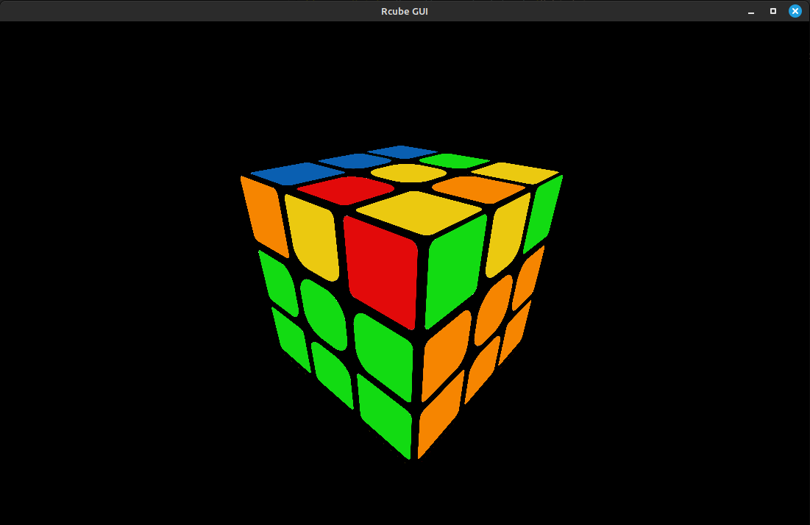

# GUI
This is a very basic rendering of the cube in 3D implementing an Arcball camera
and applying moves to the cube on user input.

<div align="center">

</div>

## Using the GUI
As well as being a standalone executable, the GUI can be linked to other
programs:

```cpp
#include "./include/rcube.hpp"
#include "./ui/ui.hpp"

void moveCallback(rcube::Move move)
{
    // your code here
}

int main()
{
    rcube::Cube cube();
    rcubeUI::runUI(&cube, moveCallback);
}
```

A `{'U', 0}` move will be returned when the window is closed.

Remember to exclude `bin/ui_main.o` when linking the program, otherwise you
will have two main functions!

## Config file
If a file named `rcube.cfg` is found in the current directory, it will be used
as a config file. Here are the parameters you can set and their default values:

```
scramble_length = 15
kociemba_threads = 4
kociemba_timeout = 1
```

If there is no such file, or it contains some syntax errors, the default values
will be used without throwing any error.